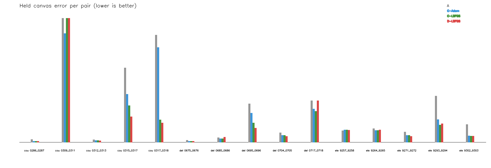

# RopStitch residual-alignment research workspace

本仓库保存基于 [RopStitch](https://arxiv.org/abs/2508.05903) 的研究代码、冻结实验协议和阶段结果。原始训练网络、CoefNetwork、双向最优平面与 TPS 流程保留；新增工作位于独立诊断目录中。

当前候选问题是：以冻结的 RopStitch `alpha=0.5` 输出为初始结果，利用两张 RGB 图像中的几何证据进一步纠正残余局部错位，同时控制新增畸变、已对齐区域退化和有效内容损失。

这还是研究诊断，不是已确认的论文创新。大残差筛选问题属于后加策略，Adam-150 求解不足属于后加残差优化器，均不归因于 RopStitch 内部。

## 当前结论

统一强基线复核使用 ETH3D courtyard、delivery_area、electro 共 15 个开发图对：

| 组别 | 点数加权几何误差 |
|---|---:|
| A：RopStitch，alpha=0.5 | 38.73 px |
| C-Adam：常规可靠性 + Adam-150 | 31.10 px |
| C-LBFGS：相同 C + 充分求解 | 24.09 px |
| D-LBFGS：真值筛选诊断 | 22.64 px |

C-LBFGS 在 13/15 对上改善 A，并获得约 91% 的 A 到 D 降幅。D 没有跨场景稳定领先，因此 C-LBFGS 只作为常规强基线保留，不包装成新方法，也不据此训练筛选网络。

当前仍有证据的失败是：

- 结构可行边界可能阻塞 C/D-LBFGS 的全部更新；
- 少量局部大错位区域缺少被常规可靠性规则接纳的正确空间支撑；
- 几何误差下降可能伴随已对齐区域退化或有效覆盖损失。

随后完成了普通 RGB 残余网络的最小训练实验。该网络冻结 RopStitch，只预测
目标侧 13×13 小幅残余，并使用局部 RGB 相关性、几何监督、已对齐区域保护、
结构和重叠损失。新场景 `kicker` 验证仅有 2/5 对改善，点数加权误差
42.29→41.61 px，且部分已对齐区域明显退化。因此普通版本提前停止，未实现
内容引导传播模块，也未打开 `terrace` 锁定测试调参。

完整进度见 [PROGRESS.md](PROGRESS.md)，当前研究边界见 [CURRENT_RESEARCH_POSITION.md](diagnostics_parallax_20260929/CURRENT_RESEARCH_POSITION.md)，最终复核见 [REPORT.md](diagnostics_parallax_20260929/runs/unified_strong_baseline_review/REPORT.md)。

## 目录

- `woCoefNet/`：原始对齐网络代码。
- `wCoefNet/`：原始系数网络及已归档 alpha 相关代码。
- `diagnostics_geometry_20260915/`：早期几何和效率诊断脚本；该方向不作为当前主线。
- `diagnostics_parallax_20260929/`：ETH3D 真值、候选对应、残差网格与强基线诊断。
- `residual_learning_20260930/`：普通 RGB 残余网络、冻结划分、训练权重和失败结论。
- `docs/ROPSTITCH_UPSTREAM_README.md`：原始项目说明。

## 本仓库不包含

- UDIS-D/ETH3D 图像、深度和标定压缩包；
- `woCoefNet/model_homo/epoch100_model.pth`；
- `wCoefNet/model_coef/epoch050_coefmodel.pth`；
- RoMa 和 DINOv2 权重；
- 第三方仓库、缓存及大体积候选/形变中间结果。

这些文件应按原路径放在本地。Git 中保留了运行脚本、固定图对、汇总 CSV/JSON、关键图和哈希记录，便于继续复核。

## 当前停止项

- 不训练 AlphaPredictor；
- 不恢复自适应 alpha 或空间投影面研究；
- 不训练对应可靠性预测器；
- 不扩大数据或自动追加实验。
- 普通残余网络未通过跨场景门槛，不启动内容引导传播消融。

下一步只应依据现有证据决定是否增加真正多场景训练规模；若不增加，应更换研究切口。
